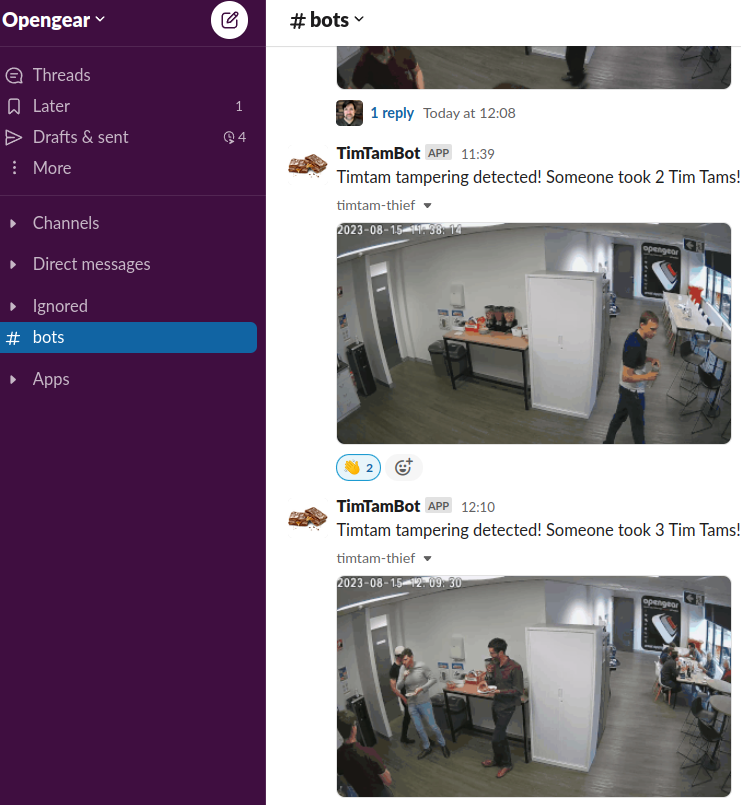

# Tim Tam Cam

The winning project of the 2021 Opengear Hackathon.

A Raspberry Pi runs a daemon that listens to a weight sensor rigged to the
box containing tim-tams. If a tim-tam is stolen, a short video is recorded
on a nearby WiFi camera, converted into a gif, and uploaded to our office
Slack channel.

Tools: OpenCV, RTSP, Slack API, RPi GPIO, scapy

## Examples

